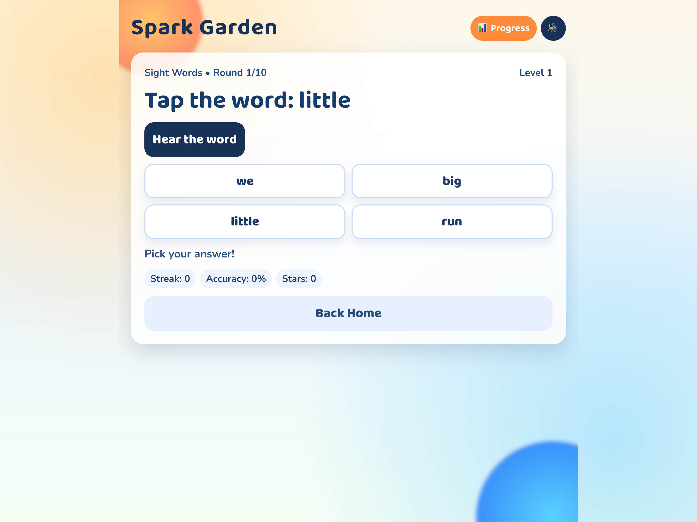
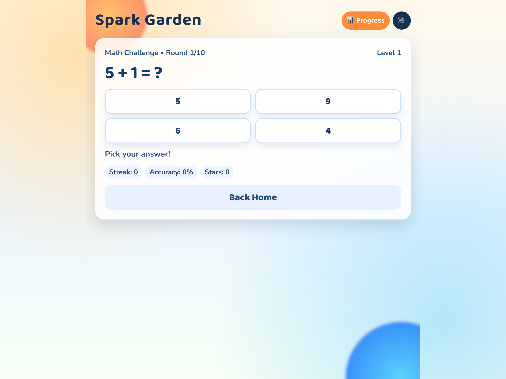

# Spark Garden — Kindergarten Learning Game

A fun, touch-first interactive learning website for kindergarten children to practice **sight words** and **early math** through short, game-style challenge sessions with animations, sounds, and positive feedback.

---

## About

Spark Garden is designed for children who are just starting their reading and math journey. It keeps sessions short (15–20 minutes), rewards progress with stars and streaks, and adapts difficulty automatically so children stay challenged without feeling frustrated.

### Features

- **Sight Word Game** — Hear a word spoken aloud, then tap the correct word from the options.
- **Math Game** — Solve simple addition and subtraction problems (within 15) by tapping the right answer.
- **Adaptive Difficulty** — 3 levels per game mode. Level rises on a 3-answer streak; drops gently after a miss to keep confidence high.
- **Sound Effects** — Positive chime on correct answers, gentle tone on mistakes. Toggle sound on/off at any time.
- **Browser Speech Synthesis** — The sight-word game can read words aloud using the device's built-in voice.
- **Reward Screen** — Celebrates the child after completing all 10 rounds in a session.
- **Parent Progress Dashboard** — See accuracy, streaks, total stars, sessions completed, and individually mastered sight words.
- **Progress Persistence** — All progress is saved to the device automatically (no account or internet required).
- **Responsive and Touch-First** — Designed for phones and tablets; works on laptops and desktops too.

---

## Kindergarten Scope

| Area              | Coverage                                                                                                                                     |
| ----------------- | -------------------------------------------------------------------------------------------------------------------------------------------- |
| Sight Words       | 20 high-frequency kindergarten words (the, and, is, it, you, we, can, go, see, play, look, little, big, come, here, jump, run, like, my, to) |
| Math              | Addition and subtraction within 15, counting, and number comparisons                                                                         |
| Session length    | 10 rounds per session (~15–20 minutes)                                                                                                       |
| Difficulty levels | 3 per game mode (auto-adapts based on accuracy)                                                                                              |

---

## How to Use

### For Parents / Setup

**Prerequisites**

- Node.js 18 or later
- npm 9 or later

**Install and run locally**

```bash
# Clone or download the project, then:
cd learning-game
npm install
npm run dev
```

Open `http://localhost:5173` in any modern browser on your phone, tablet, or computer.

**Build for production**

```bash
npm run build
npm run preview
```

The `dist/` folder can be deployed to any static hosting service (Netlify, GitHub Pages, Vercel, etc.).

### For Children / Playing the App

1. Open the app in a browser.
2. Tap **Sight Word Game** to practise reading words, or **Math Game** to practise numbers.
3. Read the question at the top of the screen and tap the correct answer button.
4. In the sight-word game, tap **Hear the word** to hear the word spoken aloud before choosing.
5. Earn stars for every correct answer — streak bonuses unlock extra stars!
6. After 10 rounds, the reward screen shows your score. Tap **Play Again** to keep going.
7. Tap the **Sound: On / Off** button in the top bar to mute or unmute sounds at any time.

### For Parents / Checking Progress

1. From the home screen, tap **Parent Progress**.
2. View accuracy and best streaks for both Sight Words and Math.
3. See every sight word your child has mastered shown as coloured badges.
4. Tap **Reset Progress** to clear all saved data and start fresh.

---

## Project Structure

```
learning-game/
├── src/
│   ├── App.jsx        # Main app — all screens, game logic, adaptive difficulty
│   ├── App.css        # Game UI styles and animations
│   ├── index.css      # Global typography, background, and resets
│   └── main.jsx       # React entry point
├── public/            # Static assets
├── index.html         # App shell
├── package.json
└── vite.config.js
```

---

## Tech Stack

| Tool           | Purpose                                      |
| -------------- | -------------------------------------------- |
| React 19       | UI and state management                      |
| Vite 8         | Dev server and production bundler            |
| Web Speech API | Read sight words aloud (built into browsers) |
| Web Audio API  | Sound effects (no audio files required)      |
| localStorage   | Progress persistence (no backend needed)     |
| CSS animations | Celebratory effects and visual feedback      |

---

## Screenshots

### Home Screen


### Sight Words Game Screen



### Math Game Screen



---

## License

Copyright 2026 Spark Garden Contributors

Licensed under the Apache License, Version 2.0 (the "License");
you may not use this file except in compliance with the License.
You may obtain a copy of the License at

    http://www.apache.org/licenses/LICENSE-2.0

Unless required by applicable law or agreed to in writing, software
distributed under the License is distributed on an "AS IS" BASIS,
WITHOUT WARRANTIES OR CONDITIONS OF ANY KIND, either express or implied.
See the License for the specific language governing permissions and
limitations under the License.
